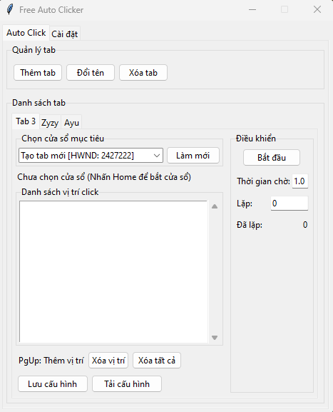

# Free Auto Clicker

Ứng dụng tự động click chuột mạnh mẽ và linh hoạt cho Windows, có khả năng click đồng thời trên nhiều cửa sổ khác nhau và không chiếm chuột.

## Demo



## Cài đặt nhanh

1. Tải file [Free Auto Clicker.zip](https://github.com/Long173/auto-click/raw/main/Free%20Auto%20Clicker.zip) từ repository
2. Giải nén file zip vào vị trí mong muốn trên máy tính của bạn
3. Mở thư mục vừa giải nén và chạy file "Run Auto Clicker.bat" hoặc chạy trực tiếp file "Free Auto Clicker.exe"
4. Xem file `HUONG_DAN_SU_DUNG.txt` để biết thêm chi tiết về cách sử dụng

### Xử lý lỗi thường gặp

- **Windows SmartScreen cảnh báo**: Nếu Windows hiển thị cảnh báo "Windows protected your PC", nhấp vào "More info" và sau đó chọn "Run anyway"
- **Lỗi không mở được file .exe**: Đảm bảo bạn đã giải nén hoàn toàn file zip trước khi chạy, không chạy trực tiếp từ bên trong file zip
- **Lỗi thiếu file DLL**: Đảm bảo tất cả các file trong thư mục giải nén đều được giữ nguyên, không xóa bất kỳ file nào
- **Chương trình không phản hồi**: Thử chạy với quyền administrator bằng cách nhấp chuột phải vào file .exe và chọn "Run as administrator"

### Yêu cầu hệ thống cho file thực thi

- Windows 10 hoặc mới hơn (đã được thử nghiệm trên Windows 10 và Windows 11)
- Không cần cài đặt Python hoặc các thư viện phụ thuộc
- Khoảng 15MB dung lượng đĩa trống
- RAM khuyến nghị: tối thiểu 2GB
- Không yêu cầu quyền administrator để chạy (trừ khi bạn gặp vấn đề về quyền truy cập)

## Tính năng

- **Click không chiếm chuột**: Click vào các ứng dụng mà không làm gián đoạn thao tác chuột của bạn
- **Đa tab**: Tạo nhiều tab khác nhau, mỗi tab có thể nhắm vào một cửa sổ riêng biệt
- **Kéo thả tab**: Sắp xếp lại thứ tự các tab bằng cách kéo và thả
- **Tùy chọn thời gian**: Điều chỉnh thời gian chờ giữa các lần click
- **Lặp lại tùy chọn**: Đặt số lần lặp lại cụ thể hoặc chọn chế độ lặp lại vô hạn
- **Phím tắt toàn cục**: Sử dụng phím tắt để điều khiển ứng dụng từ bất kỳ đâu
- **Lưu/tải cấu hình**: Lưu và tải cấu hình cho từng tab hoặc toàn bộ ứng dụng
- **Tự động lưu**: Tự động lưu tất cả cấu hình và khôi phục khi khởi động lại

## Phím tắt

- **Home**: Bắt cửa sổ đang active hiện tại
- **End**: Bắt đầu/dừng tự động click
- **Page Up**: Thêm vị trí chuột hiện tại vào danh sách

## Yêu cầu hệ thống

- Windows 10 hoặc mới hơn
- Python 3.7 hoặc mới hơn

## Cài đặt

1. Cài đặt Python từ [python.org](https://www.python.org/downloads/)
2. Cài đặt các thư viện cần thiết:

```
pip install -r requirements.txt
```

3. Chạy ứng dụng:

```
python pure_autoclick.py
```

## Các thư viện phụ thuộc

- pyautogui: Để mô phỏng thao tác chuột
- pywin32: Để tương tác với cửa sổ Windows
- keyboard: Để đăng ký phím tắt toàn cục
- psutil: Để quản lý quy trình
- pillow: Phụ thuộc của pyautogui

## Hướng dẫn sử dụng

### Tạo một tab mới

1. Nhấp vào nút "Thêm tab" trong phần "Quản lý tab"
2. Nhập tên tab và nhấn Enter hoặc nhấp vào "Tạo tab"

### Thêm vị trí để click

1. Di chuyển chuột đến vị trí bạn muốn click
2. Nhấn phím **Page Up** để thêm vị trí đó vào danh sách

### Chọn cửa sổ mục tiêu

1. Mở cửa sổ bạn muốn click
2. Khi cửa sổ đó đang active, nhấn phím **Home** để bắt cửa sổ
3. Hoặc chọn từ danh sách cửa sổ trong dropdown

### Bắt đầu auto click

1. Đặt thời gian chờ giữa các lần click (giây)
2. Đặt số lần lặp lại (0 = vô hạn)
3. Nhấp nút "Bắt đầu" hoặc nhấn phím **End**

### Dừng auto click

- Nhấp nút "Dừng" hoặc nhấn phím **End**

### Lưu cấu hình

- Nhấp vào "Lưu cấu hình" trong tab để lưu cấu hình của tab đó
- Cấu hình sẽ tự động lưu khi đóng ứng dụng

### Tải cấu hình

- Nhấp vào "Tải cấu hình" trong tab để tải cấu hình cho tab đó
- Cấu hình sẽ tự động tải khi mở ứng dụng

## Lưu ý

- Ứng dụng sử dụng WinAPI để gửi thông điệp click trực tiếp đến cửa sổ, vì vậy không cần phải di chuyển chuột thật
- Phím tắt Home và Page Up hoạt động từ bất kỳ ứng dụng nào, không cần phải là cửa sổ active
- Tab đang chạy sẽ được đánh dấu bằng ký hiệu "▶" ở trước tên tab

## Giấy phép

Phần mềm này được phân phối dưới giấy phép MIT. Vui lòng tham khảo tài liệu của các thư viện được sử dụng để biết thêm về giấy phép của chúng. 